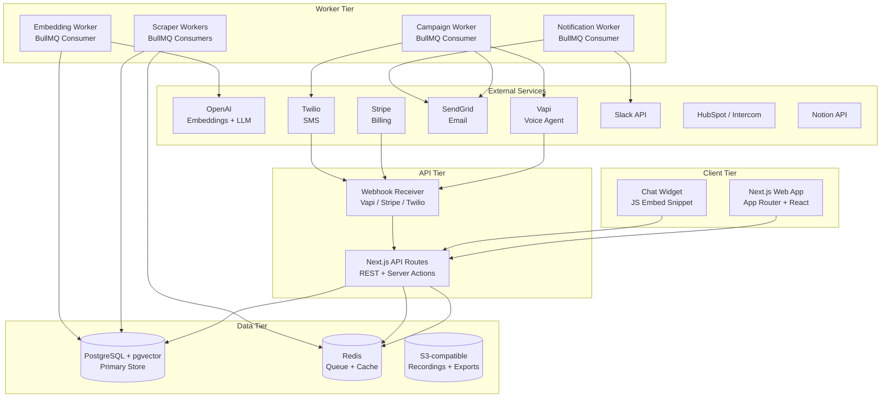
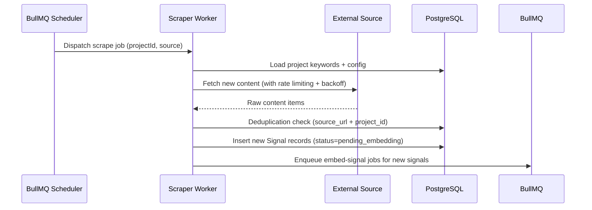
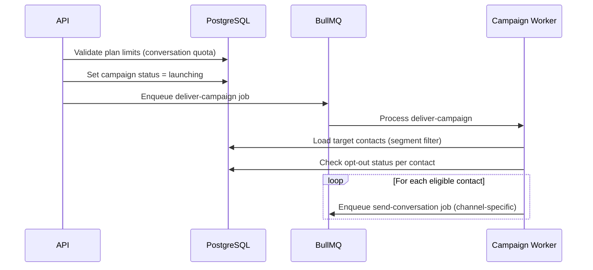

# Design Document: Market Signal Platform

## Overview

The Market Signal Platform is a PMF-as-a-service product for startup founders. It combines two signal collection layers — **active signals** (AI-driven conversations via voice, email, SMS, and chat) and **passive signals** (automated scraping of Reddit, Twitter/X, Hacker News, LinkedIn, and review sites) — into a unified intelligence feed. Founders get a live PMF score, semantic theme clusters, persona maps, and competitor gap analysis without manual research effort.

### Key Design Decisions

- **Monorepo with Next.js App Router** for the web application, with separate long-running worker processes for scraping and AI tasks. This keeps the web tier stateless and horizontally scalable while isolating CPU/IO-heavy work.
- **PostgreSQL with pgvector** as the single database, avoiding a separate vector store. Embeddings live in the same tables as signal records, enabling transactional consistency and simplified operations.
- **BullMQ + Redis** for all async job processing (scraping, embedding generation, campaign delivery, notifications). Redis also serves as the application cache layer.
- **Shared-schema multi-tenancy** with PostgreSQL Row-Level Security (RLS) policies scoped to `project_id`. All tenant data lives in one schema; RLS enforces isolation at the database level.
- **Vapi** for voice agent integration (outbound calling, transcription, and webhook delivery).
- **Stripe** for subscription billing and plan enforcement.

---

## Architecture

The platform is organized into four logical tiers:



### Deployment Model

- **Web + API**: Deployed as a Next.js application on Vercel (or a containerized Node.js service on AWS ECS). Stateless; scales horizontally.
- **Worker Tier**: Separate Node.js processes deployed as ECS tasks or Fly.io machines. Each worker type runs as an independent BullMQ consumer with configurable concurrency.
- **Database**: AWS RDS PostgreSQL 16 with the `pgvector` extension enabled, or Supabase (which ships pgvector by default).
- **Redis**: AWS ElastiCache (Redis 7) or Upstash Redis for BullMQ and caching.
- **Object Storage**: AWS S3 for call recordings and exported reports.

---

## Components and Interfaces

### 1. Authentication and Session Management

**Technology**: NextAuth.js (Auth.js v5) with email/password and Google OAuth providers.

- Sessions stored as JWTs with a short expiry (15 min access token, 7-day refresh token).
- JWT payload includes `userId`, `accountId`, and active `planTier`.
- All API routes validate the session token and extract `accountId` before any database query.

**Interface**:
```
POST /api/auth/register       — email + password registration
POST /api/auth/[...nextauth]  — NextAuth handler (login, OAuth callback, logout)
GET  /api/auth/session        — current session
```

---

### 2. Project Management Service

Handles CRUD for Projects and enforces plan-level project limits.

**Interface**:
```
GET    /api/projects                  — list projects for account
POST   /api/projects                  — create project
GET    /api/projects/:id              — get project detail
PATCH  /api/projects/:id              — update project fields
DELETE /api/projects/:id              — delete project (soft delete)
POST   /api/projects/:id/archive      — archive project
POST   /api/projects/:id/restore      — restore archived project
```

On project save, the service enqueues a `generate-keywords` job to BullMQ. The Embedding Worker picks this up, calls the OpenAI Chat Completions API with the ICP description and problem statement, and writes the resulting keyword set and subreddit candidates back to the project record.

---

### 3. Scraper Subsystem

The Scraper is a set of BullMQ workers, one per source type. Each worker is scheduled via BullMQ's repeatable job feature.

**Source Workers and Schedules**:

| Worker | Schedule | Source |
|---|---|---|
| `reddit-scraper` | Every 6 hours | Reddit API (PRAW-equivalent via `snoowrap`) |
| `twitter-scraper` | Every 30 minutes | Twitter/X API v2 |
| `hn-scraper` | Every 2 hours | Hacker News Algolia API |
| `linkedin-scraper` | Every 24 hours | LinkedIn public pages via headless browser |
| `review-scraper` | Every 7 days | G2, Trustpilot, Product Hunt, App Stores |

**Scraper Job Flow**:


**Deduplication**: A unique index on `(project_id, source_url)` in the `signals` table enforces deduplication at the database level. The scraper performs a bulk `INSERT ... ON CONFLICT DO NOTHING` and counts affected rows.

**Rate Limiting and Backoff**: Each scraper worker uses an exponential backoff strategy. On a 429 or 5xx response, the job is re-queued with a delay starting at 60 seconds, doubling on each retry up to a maximum of 1 hour. The worker also reads `Retry-After` headers where present.

---

### 4. Embedding Engine

A dedicated BullMQ worker that processes `embed-signal` jobs.

**Flow**:
1. Dequeue job with `signalId`.
2. Load signal text from PostgreSQL.
3. Call OpenAI `text-embedding-3-small` (1536 dimensions) to generate the embedding vector.
4. Write the embedding to `signals.embedding` (a `vector(1536)` column via pgvector).
5. Update `signals.status` to `embedded`.
6. Enqueue a `cluster-signals` job for the project (debounced — only one pending cluster job per project at a time).

**Clustering**:
The `cluster-signals` job runs a SQL query using pgvector's cosine distance operator (`<=>`) to find groups of signals within the 0.80 cosine similarity threshold. It uses a greedy agglomerative approach:
1. Select all embedded signals for the project ordered by creation date.
2. For each unassigned signal, find all other unassigned signals within cosine distance ≤ 0.20 (i.e., similarity ≥ 0.80).
3. Assign them to an existing cluster if one exists, or create a new cluster.
4. When a cluster reaches ≥ 5 signals and has no LLM-generated name, enqueue a `name-cluster` job.

**Cluster Naming**:
The `name-cluster` job calls the OpenAI Chat Completions API with the top 10 signal texts from the cluster and asks for a concise cluster name (≤ 6 words) and a 2-sentence summary.

---

### 5. Contact Management Service

**Interface**:
```
GET    /api/projects/:id/contacts           — list contacts (paginated)
POST   /api/projects/:id/contacts/import    — CSV upload
POST   /api/projects/:id/contacts/sync      — trigger CRM sync
GET    /api/projects/:id/contacts/:cid      — get contact
PATCH  /api/projects/:id/contacts/:cid      — update contact / tags
DELETE /api/projects/:id/contacts/:cid      — delete contact
POST   /api/projects/:id/contacts/:cid/optout — mark opted out
```

**CSV Import**: The import endpoint accepts a multipart upload. The server parses the CSV using `papaparse`, validates each row (requires at minimum one of: email or phone), and returns a validation summary before committing. Invalid rows are returned to the client with row numbers and error reasons; valid rows are bulk-inserted.

---

### 6. Campaign Service

**Interface**:
```
GET    /api/projects/:id/campaigns          — list campaigns
POST   /api/projects/:id/campaigns          — create campaign
GET    /api/projects/:id/campaigns/:cid     — get campaign detail
PATCH  /api/projects/:id/campaigns/:cid     — update campaign
POST   /api/projects/:id/campaigns/:cid/launch  — launch campaign
POST   /api/projects/:id/campaigns/:cid/pause   — pause campaign
POST   /api/projects/:id/campaigns/:cid/resume  — resume campaign
POST   /api/projects/:id/campaigns/:cid/cancel  — cancel campaign
```

**Script Generation**: On campaign creation, the service calls the OpenAI Chat Completions API with the campaign goal, product description, and ICP to generate a conversation script and AI persona. The script is stored as a structured JSON object with turn-by-turn prompts.

**Launch Flow**:


**Channel Workers**:
- `send-email`: Uses SendGrid API. Personalizes template, sends, stores `message_id` for reply tracking.
- `send-sms`: Uses Twilio Messages API. Stores `sid` for reply tracking.
- `send-voice`: Calls Vapi `POST /call` endpoint with the assistant configuration and contact phone number.
- `send-chat`: Activates the chat widget session for the contact.

---

### 7. Voice Agent Integration (Vapi)

The platform integrates with Vapi for outbound voice calls.

**Call Initiation**: The campaign worker calls `POST https://api.vapi.ai/call/phone` with:
- `phoneNumberId`: the Vapi-provisioned number for the project
- `customer.number`: the contact's phone number
- `assistant`: inline assistant config with the campaign script as the system prompt, including the probing instruction (ask "why" when response < 15 words)
- `recordingEnabled: true`

**Webhook Handling**: Vapi sends webhook events to `POST /api/webhooks/vapi`:
- `call-started`: update conversation record status
- `transcript`: store incremental transcript chunks
- `call-ended`: trigger transcript finalization and insight extraction

**Transcript Processing**: On `call-ended`, the platform:
1. Fetches the full transcript from Vapi.
2. Stores it in the `transcripts` table.
3. Enqueues an `analyze-transcript` job.
4. The analysis job calls OpenAI to extract: sentiment, pain intensity (1–10), willingness-to-pay signals, competitor mentions, and top 3 quotes.
5. Creates Active Signal records from the extracted insights.
6. Enqueues `embed-signal` jobs for the new signals.

---

### 8. Conversation Intelligence Service

Handles transcript analysis for all channels (email, SMS, voice, chat).

**Insight Extraction Prompt Structure**:
The LLM is given the full transcript and asked to return a structured JSON response:
```json
{
  "sentiment": "positive | neutral | negative",
  "pain_intensity": 1-10,
  "willingness_to_pay": true | false,
  "competitor_mentions": ["string"],
  "top_quotes": ["string", "string", "string"],
  "signal_summaries": [
    { "type": "pain_point | feature_request | ...", "text": "string" }
  ]
}
```

Each `signal_summary` becomes an Active Signal record in the `signals` table, linked to the transcript and contact.

---

### 9. Signal Feed Service

**Interface**:
```
GET /api/projects/:id/signals
  ?page=1&limit=50
  &source=reddit,twitter
  &type=pain_point,feature_request
  &sentiment=negative
  &min_relevance=20
  &date_from=ISO8601
  &date_to=ISO8601
  &sort=composite_score|recency|relevance
```

**Composite Score Calculation**:
```
composite_score = (relevance_score * 0.5) + (recency_score * 0.3) + (type_weight * 0.2)
```
Where:
- `recency_score` = 100 * exp(-age_in_days / 7) — decays over 7 days
- `type_weight` = predefined weight per signal type (pain_point: 100, feature_request: 90, competitor_mention: 80, negative_sentiment: 70, market_trend: 60, positive_sentiment: 50)

The feed query uses a materialized view `signal_feed_mv` that is refreshed every 5 minutes, enabling the 2-second load target for the first 50 results.

---

### 10. PMF Score Service

**Calculation**:
```
pmf_score = (count of "very_disappointed" responses / total PMF survey responses) * 100
```

The score is recalculated whenever a new PMF survey transcript is analyzed. The result is stored in `pmf_score_snapshots` with a timestamp, enabling the 90-day trend chart.

**Segment Breakdown**: The same calculation is run per contact segment tag, producing per-segment scores stored alongside the overall score.

**Alert Trigger**: After each recalculation, the service checks if the score has changed by ≥ 5 points in the past 24 hours. If so, it enqueues a `send-pmf-alert` notification job.

---

### 11. Notification Service

A BullMQ worker that processes notification jobs:

| Job Type | Trigger | Channels |
|---|---|---|
| `pmf-alert` | PMF score ±5 in 24h | Email + in-app |
| `cluster-alert` | New cluster ≥ 10 signals in 48h | In-app |
| `quota-warning` | 90% conversation quota used | Email + in-app |
| `quota-exceeded` | 100% conversation quota used | Email + in-app |
| `payment-failed` | Stripe webhook | Email |
| `weekly-digest` | Monday 09:00 founder timezone | Email |

In-app notifications are stored in the `notifications` table and delivered to the client via Server-Sent Events (SSE) on `GET /api/notifications/stream`.

---

### 12. Integration Service

Handles outbound integrations (Slack, HubSpot, Intercom, Notion, webhooks, Segment).

**Webhook Delivery**: When a new signal is created or the PMF score changes, the service loads all registered webhook endpoints for the project and enqueues a `deliver-webhook` job per endpoint. The job POSTs the event payload with an HMAC-SHA256 signature header (`X-Signature`). Failed deliveries are retried with exponential backoff up to 3 times.

**Slack**: Uses the Slack Web API `chat.postMessage` method. Signal summaries and PMF alerts are formatted as Slack Block Kit messages.

**HubSpot / Intercom**: Contact sync uses the respective CRM's REST API. Signal-derived tags are pushed as contact properties/attributes.

**Notion**: Uses the Notion API to create pages in a Founder-configured database. Signal reports are formatted as Notion blocks.

---

### 13. Billing Service

Wraps Stripe for subscription management and plan enforcement.

**Plan Enforcement**: Every campaign conversation initiation checks the account's monthly conversation count against the plan limit. This check is performed in a Redis atomic increment (`INCR account:{id}:conversations:{month}`) to avoid race conditions under concurrent campaign delivery.

**Stripe Webhooks**: Handled at `POST /api/webhooks/stripe`:
- `invoice.payment_succeeded`: update plan status
- `invoice.payment_failed`: start 7-day grace period timer
- `customer.subscription.updated`: update plan tier
- `customer.subscription.deleted`: downgrade to free tier

---

### 14. Chat Widget

A self-contained JavaScript bundle (`widget.js`) served from the platform's CDN. Founders embed it with:
```html
<script src="https://cdn.marketsignal.io/widget.js" 
        data-project-id="proj_xxx" 
        data-campaign-id="camp_xxx">
</script>
```

The widget opens a chat panel and communicates with the platform via WebSocket (Socket.io) or long-polling fallback. Conversations are routed through the Campaign Service using the embedded `campaign-id`.

---

## Data Models

### Core Tables

```sql
-- Accounts (one per founder/team)
CREATE TABLE accounts (
  id            UUID PRIMARY KEY DEFAULT gen_random_uuid(),
  email         TEXT NOT NULL UNIQUE,
  name          TEXT,
  plan_tier     TEXT NOT NULL DEFAULT 'free',  -- free | starter | growth | enterprise
  stripe_customer_id TEXT,
  timezone      TEXT NOT NULL DEFAULT 'UTC',
  created_at    TIMESTAMPTZ NOT NULL DEFAULT now(),
  updated_at    TIMESTAMPTZ NOT NULL DEFAULT now()
);

-- Projects
CREATE TABLE projects (
  id                  UUID PRIMARY KEY DEFAULT gen_random_uuid(),
  account_id          UUID NOT NULL REFERENCES accounts(id) ON DELETE CASCADE,
  name                TEXT NOT NULL,
  description         TEXT NOT NULL,
  icp_description     TEXT NOT NULL,
  problem_statement   TEXT NOT NULL,
  competitor_names    TEXT[] DEFAULT '{}',
  keywords            TEXT[] DEFAULT '{}',
  subreddit_candidates TEXT[] DEFAULT '{}',
  status              TEXT NOT NULL DEFAULT 'active',  -- active | archived | deleted
  created_at          TIMESTAMPTZ NOT NULL DEFAULT now(),
  updated_at          TIMESTAMPTZ NOT NULL DEFAULT now()
);

-- Signals (both active and passive)
CREATE TABLE signals (
  id              UUID PRIMARY KEY DEFAULT gen_random_uuid(),
  project_id      UUID NOT NULL REFERENCES projects(id) ON DELETE CASCADE,
  source          TEXT NOT NULL,  -- reddit | twitter | hn | linkedin | review | email | sms | voice | widget
  signal_type     TEXT NOT NULL,  -- pain_point | feature_request | competitor_mention | market_trend | positive_sentiment | negative_sentiment
  signal_kind     TEXT NOT NULL DEFAULT 'passive',  -- passive | active
  content         TEXT NOT NULL,
  source_url      TEXT,
  author          TEXT,
  relevance_score INTEGER NOT NULL DEFAULT 0,  -- 0-100
  sentiment       TEXT,  -- positive | neutral | negative
  pain_intensity  INTEGER,  -- 1-10, null for passive signals
  is_opportunity  BOOLEAN NOT NULL DEFAULT false,
  is_bookmarked   BOOLEAN NOT NULL DEFAULT false,
  custom_label    TEXT,
  is_dismissed    BOOLEAN NOT NULL DEFAULT false,
  embedding       vector(1536),
  status          TEXT NOT NULL DEFAULT 'pending_embedding',  -- pending_embedding | embedded | excluded
  metadata        JSONB DEFAULT '{}',
  ingested_at     TIMESTAMPTZ NOT NULL DEFAULT now(),
  created_at      TIMESTAMPTZ NOT NULL DEFAULT now(),
  UNIQUE (project_id, source_url)  -- deduplication constraint
);

CREATE INDEX signals_project_id_idx ON signals(project_id);
CREATE INDEX signals_embedding_idx ON signals USING ivfflat (embedding vector_cosine_ops) WITH (lists = 100);
CREATE INDEX signals_ingested_at_idx ON signals(project_id, ingested_at DESC);

-- Theme Clusters
CREATE TABLE theme_clusters (
  id              UUID PRIMARY KEY DEFAULT gen_random_uuid(),
  project_id      UUID NOT NULL REFERENCES projects(id) ON DELETE CASCADE,
  name            TEXT,
  summary         TEXT,
  signal_count    INTEGER NOT NULL DEFAULT 0,
  trend_direction TEXT NOT NULL DEFAULT 'stable',  -- growing | stable | declining
  is_dismissed    BOOLEAN NOT NULL DEFAULT false,
  created_at      TIMESTAMPTZ NOT NULL DEFAULT now(),
  updated_at      TIMESTAMPTZ NOT NULL DEFAULT now()
);

-- Signal-to-Cluster membership
CREATE TABLE signal_cluster_memberships (
  signal_id   UUID NOT NULL REFERENCES signals(id) ON DELETE CASCADE,
  cluster_id  UUID NOT NULL REFERENCES theme_clusters(id) ON DELETE CASCADE,
  PRIMARY KEY (signal_id, cluster_id)
);

-- Contacts
CREATE TABLE contacts (
  id            UUID PRIMARY KEY DEFAULT gen_random_uuid(),
  project_id    UUID NOT NULL REFERENCES projects(id) ON DELETE CASCADE,
  first_name    TEXT NOT NULL,
  last_name     TEXT,
  email         TEXT,
  phone         TEXT,
  segment_tags  TEXT[] DEFAULT '{}',
  opted_out_email   BOOLEAN NOT NULL DEFAULT false,
  opted_out_sms     BOOLEAN NOT NULL DEFAULT false,
  opted_out_voice   BOOLEAN NOT NULL DEFAULT false,
  crm_source    TEXT,  -- hubspot | intercom | mailchimp | csv
  crm_id        TEXT,
  created_at    TIMESTAMPTZ NOT NULL DEFAULT now(),
  updated_at    TIMESTAMPTZ NOT NULL DEFAULT now(),
  CONSTRAINT contact_has_channel CHECK (email IS NOT NULL OR phone IS NOT NULL)
);

-- Campaigns
CREATE TABLE campaigns (
  id              UUID PRIMARY KEY DEFAULT gen_random_uuid(),
  project_id      UUID NOT NULL REFERENCES projects(id) ON DELETE CASCADE,
  name            TEXT NOT NULL,
  goal            TEXT NOT NULL,  -- pmf_survey | pain_point_discovery | feature_validation | churn_investigation
  channels        TEXT[] NOT NULL,  -- email | sms | voice | widget
  segment_filter  TEXT[] DEFAULT '{}',  -- contact segment tags to target
  script          JSONB NOT NULL DEFAULT '{}',
  persona         JSONB NOT NULL DEFAULT '{}',
  status          TEXT NOT NULL DEFAULT 'draft',  -- draft | launching | active | paused | completed | cancelled
  conversation_count INTEGER NOT NULL DEFAULT 0,
  created_at      TIMESTAMPTZ NOT NULL DEFAULT now(),
  updated_at      TIMESTAMPTZ NOT NULL DEFAULT now()
);

-- Conversations (one per contact per campaign)
CREATE TABLE conversations (
  id              UUID PRIMARY KEY DEFAULT gen_random_uuid(),
  campaign_id     UUID NOT NULL REFERENCES campaigns(id) ON DELETE CASCADE,
  contact_id      UUID NOT NULL REFERENCES contacts(id) ON DELETE CASCADE,
  project_id      UUID NOT NULL REFERENCES projects(id) ON DELETE CASCADE,
  channel         TEXT NOT NULL,  -- email | sms | voice | widget
  status          TEXT NOT NULL DEFAULT 'pending',  -- pending | in_progress | completed | opted_out | failed
  turn_count      INTEGER NOT NULL DEFAULT 0,
  external_id     TEXT,  -- Vapi call ID, Twilio SID, SendGrid message ID
  created_at      TIMESTAMPTZ NOT NULL DEFAULT now(),
  updated_at      TIMESTAMPTZ NOT NULL DEFAULT now()
);

-- Transcripts
CREATE TABLE transcripts (
  id              UUID PRIMARY KEY DEFAULT gen_random_uuid(),
  conversation_id UUID NOT NULL REFERENCES conversations(id) ON DELETE CASCADE,
  project_id      UUID NOT NULL REFERENCES projects(id) ON DELETE CASCADE,
  content         TEXT NOT NULL,
  sentiment       TEXT,
  pain_intensity  INTEGER,
  wtp_signal      BOOLEAN,
  competitor_mentions TEXT[] DEFAULT '{}',
  top_quotes      TEXT[] DEFAULT '{}',
  recording_url   TEXT,  -- S3 URL for voice recordings
  analyzed_at     TIMESTAMPTZ,
  created_at      TIMESTAMPTZ NOT NULL DEFAULT now()
);

-- PMF Score Snapshots
CREATE TABLE pmf_score_snapshots (
  id              UUID PRIMARY KEY DEFAULT gen_random_uuid(),
  project_id      UUID NOT NULL REFERENCES projects(id) ON DELETE CASCADE,
  score           NUMERIC(5,2) NOT NULL,
  response_count  INTEGER NOT NULL,
  segment_scores  JSONB DEFAULT '{}',  -- { "segment_tag": score }
  snapshot_date   DATE NOT NULL,
  created_at      TIMESTAMPTZ NOT NULL DEFAULT now(),
  UNIQUE (project_id, snapshot_date)
);

-- Notifications
CREATE TABLE notifications (
  id              UUID PRIMARY KEY DEFAULT gen_random_uuid(),
  account_id      UUID NOT NULL REFERENCES accounts(id) ON DELETE CASCADE,
  project_id      UUID REFERENCES projects(id) ON DELETE CASCADE,
  type            TEXT NOT NULL,
  title           TEXT NOT NULL,
  body            TEXT NOT NULL,
  is_read         BOOLEAN NOT NULL DEFAULT false,
  created_at      TIMESTAMPTZ NOT NULL DEFAULT now()
);

-- Integrations
CREATE TABLE integrations (
  id              UUID PRIMARY KEY DEFAULT gen_random_uuid(),
  account_id      UUID NOT NULL REFERENCES accounts(id) ON DELETE CASCADE,
  provider        TEXT NOT NULL,  -- slack | hubspot | intercom | notion | segment
  access_token    TEXT NOT NULL,  -- encrypted at rest
  config          JSONB DEFAULT '{}',
  created_at      TIMESTAMPTZ NOT NULL DEFAULT now(),
  updated_at      TIMESTAMPTZ NOT NULL DEFAULT now(),
  UNIQUE (account_id, provider)
);

-- Webhook Endpoints
CREATE TABLE webhook_endpoints (
  id              UUID PRIMARY KEY DEFAULT gen_random_uuid(),
  project_id      UUID NOT NULL REFERENCES projects(id) ON DELETE CASCADE,
  url             TEXT NOT NULL,
  secret          TEXT NOT NULL,  -- for HMAC signing
  events          TEXT[] NOT NULL,  -- signal.created | pmf_score.changed
  is_active       BOOLEAN NOT NULL DEFAULT true,
  created_at      TIMESTAMPTZ NOT NULL DEFAULT now()
);

-- Audit Log
CREATE TABLE audit_log (
  id              UUID PRIMARY KEY DEFAULT gen_random_uuid(),
  account_id      UUID NOT NULL REFERENCES accounts(id),
  actor_id        UUID,
  action          TEXT NOT NULL,
  resource_type   TEXT NOT NULL,
  resource_id     UUID,
  metadata        JSONB DEFAULT '{}',
  created_at      TIMESTAMPTZ NOT NULL DEFAULT now()
);
```

### Row-Level Security

All tables with `project_id` or `account_id` have RLS policies enabled. The application sets `app.current_account_id` as a session variable before executing queries:

```sql
ALTER TABLE signals ENABLE ROW LEVEL SECURITY;
CREATE POLICY signals_isolation ON signals
  USING (project_id IN (
    SELECT id FROM projects WHERE account_id = current_setting('app.current_account_id')::uuid
  ));
```

### Materialized View for Signal Feed

```sql
CREATE MATERIALIZED VIEW signal_feed_mv AS
SELECT
  s.*,
  (s.relevance_score * 0.5
   + (100 * exp(-EXTRACT(EPOCH FROM (now() - s.ingested_at)) / 604800)) * 0.3
   + CASE s.signal_type
       WHEN 'pain_point'          THEN 100
       WHEN 'feature_request'     THEN 90
       WHEN 'competitor_mention'  THEN 80
       WHEN 'negative_sentiment'  THEN 70
       WHEN 'market_trend'        THEN 60
       ELSE 50
     END * 0.2
  ) AS composite_score
FROM signals s
WHERE s.status != 'excluded'
  AND s.is_dismissed = false;

CREATE INDEX signal_feed_mv_project_score_idx
  ON signal_feed_mv(project_id, composite_score DESC);
```

---

## Correctness Properties

*A property is a characteristic or behavior that should hold true across all valid executions of a system — essentially, a formal statement about what the system should do. Properties serve as the bridge between human-readable specifications and machine-verifiable correctness guarantees.*

